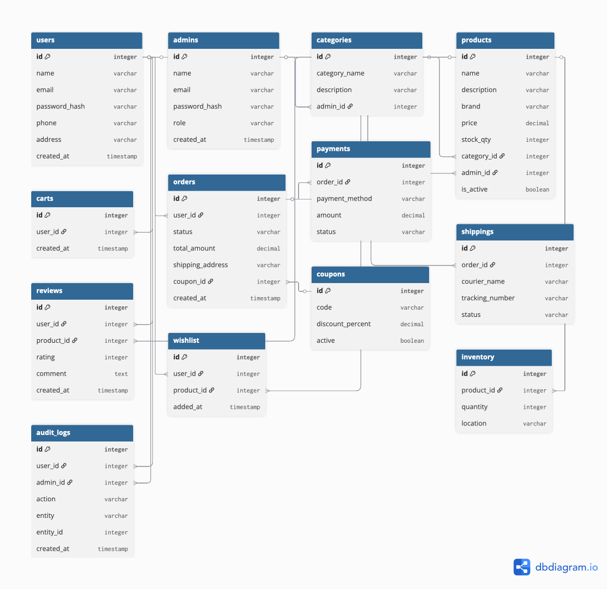

# 🛒 E-Commerce Platform Backend
# 📌 Project Overview
• This project is a full-fledged E-Commerce backend built with FastAPI, SQLAlchemy, and PostgreSQL. It simulates a real-world online shopping platform where users can:
 - Browse products by categories
 - Add products to cart and place orders
 - Make payments and track shipping
 - Write reviews and manage wishlists
• Admins can manage products, categories, inventory, and monitor user activities. The project is designed with JWT-based authentication, secure endpoints, and a scalable relational database schema.

# Project Structure:
```
e-commerce/
│
├─ app/
│  ├─ main.py              # FastAPI app initialization
│  ├─ models.py            # SQLAlchemy models
│  ├─ database.py          # PostgreSQL connection & session
│  ├─ auth_utils.py        # JWT token creation & password hashing
│  ├─ dependencies.py      # Current user/admin dependency
│  ├─ schemas.py           # Request & Response validation
│  └─ routers/             # API endpoints per entity
│      ├─ userpy
│      ├─ admin.py
│      ├─ products.py
│      ├─ categories.py
│      ├─ inventory.py
│      ├─ cart.py
│      ├─ orders.py
│      ├─ payments.py
│      ├─ shipping.py
│      ├─ reviews.py
│      ├─ coupons.py
│      └─ wishlist.py
├─ .env                    # Environment variables
├─ requirements.txt        # Python dependencies
└─ README.md
```

# 🔗 ER Diagram

The following diagram represents the entities and relationships in the e-commerce project:



The database is designed to include all essential entities and relationships:
1. Users & Admins
2. Products & Categories
3. Inventory
4. Cart & Cart Items
5. Orders & Order Items
6. Payments
7. Shipping
8. Reviews
9. Coupons
10. Wishlist
11. Audit Log

Relationships:
1. One-to-Many: Category → Products, User → Orders, Order → OrderItems
2. Many-to-Many: Users ↔ Products via CartItems & OrderItems
3. One-to-One: Order → Payment, Order → Shipping

# 🌟 Features
1. User & Admin Authentication: Secure JWT-based login and registration.
2. Product Management: Add, update, view, and categorize products.
3. Inventory Management: Track stock and product locations.
4. Cart & Wishlist: Users can manage their shopping cart and wishlist.
5. Orders & Payments: Place orders, process payments, and track shipments.
6. Reviews & Ratings: Users can submit reviews for purchased products.
7. Coupons & Discounts: Apply discount codes for orders.
8. Audit Logging: Track user and admin actions in the system.
9. Scalable & Modular: Clean code structure for easy feature expansion.
    
# 🎯 Objectives
The main goals of this project are:
1. Design a normalized ER diagram for an e-commerce system.
2. Build a RESTful API backend using FastAPI and SQLAlchemy.
3. Implement secure authentication for users and admins.
4. Track orders, payments, and shipping efficiently.
5. Ensure data consistency and audit logging.

# 🧩 How It Works
# 1. Users
 - Users can register, login, and manage their profile.
 - Add products to cart or wishlist.
 - Place orders and apply coupons for discounts.
 - Review products they purchased.
# 2. Admins
 - Create, update, and delete products and categories.
 - Manage inventory and stock.
 - View logs of user/admin actions for auditing.
# 3. Products & Categories
 - Products are linked to categories for easy browsing.
 - Each product has details like price, stock, description, and brand.
 - Inventory tracks product quantity and location.
# 4. Cart & Orders
 - Users can add multiple items to the cart.
 - When an order is placed:
 - Order items are created automatically
 - Payment and shipping entries are generated
 - One order → One payment and One shipping (1:1 relationship)
# 5. Payments & Shipping
 - Payment status is tracked (pending, completed, failed).
 - Shipping info includes courier, tracking number, and delivery status.
# 6. Reviews & Wishlist
 - Users can post reviews for products with rating and comments.
 - Wishlist allows users to save products for later purchase.
# 7. Coupons & Discounts
 - Admins can create coupons with percentage discounts and validity period.
 - Orders can apply coupons if they meet the minimum amount.
# 8. Audit Logs
 - Tracks all actions performed by users and admins.
 - Helps in monitoring changes and maintaining security.
   
# 🛠️⚙️ Technologies & Tools
- Backend Framework: FastAPI
- ORM : SQLAlchemy
- Database: PostgreSQL
- Authentication: JWT+ OAuth2 (JSON Web Tokens)
- Password Security: bcrypt (via Passlib)
- Environment Management: python-dotenv
- Documentation: Swagger UI (auto-generated)
- ER Diagram: draw.io / diagrams.net

